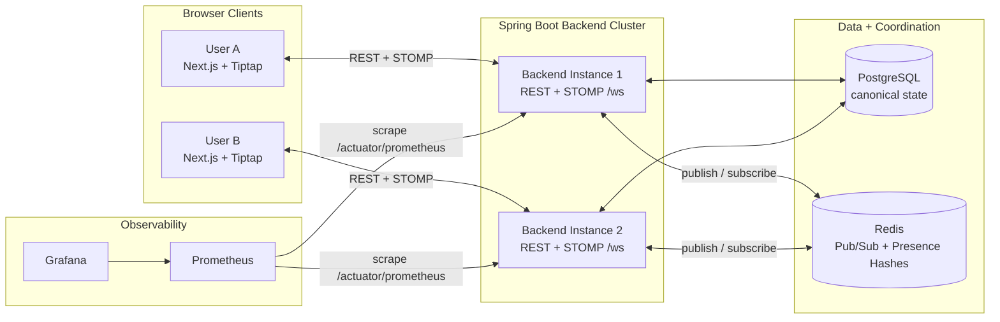
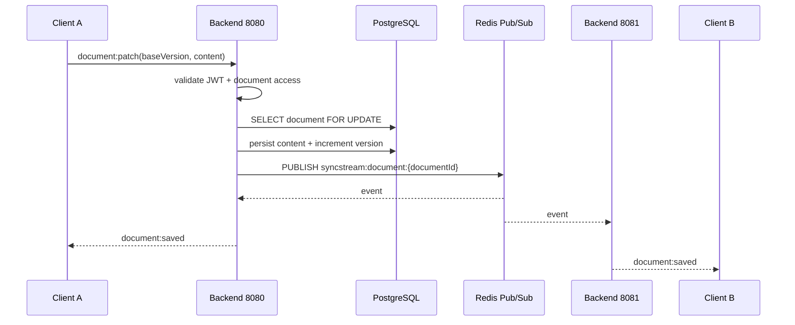
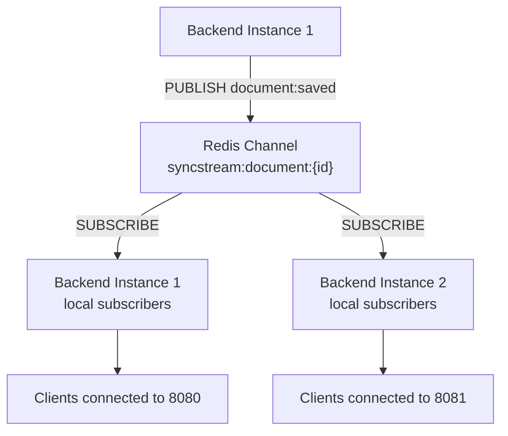
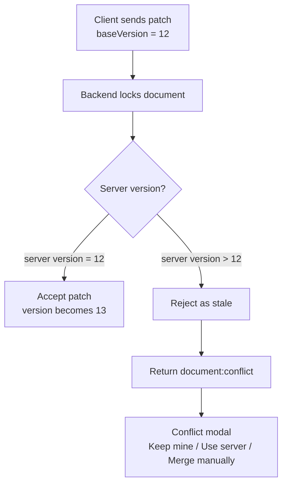
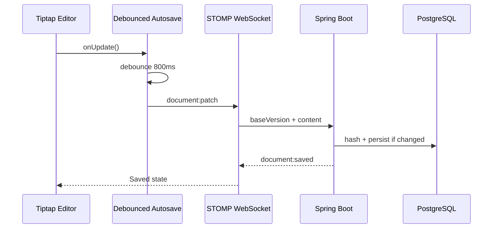
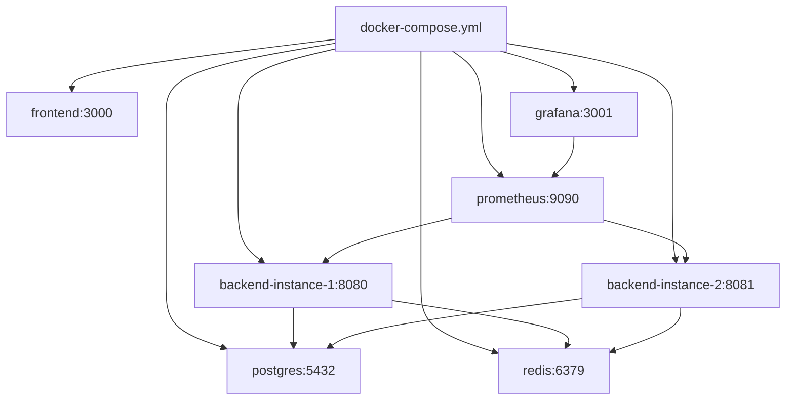

# SyncStream

> A distributed real-time collaboration platform built with Next.js, Spring Boot, PostgreSQL, Redis Pub/Sub, WebSockets, Prometheus, and Grafana.


## Overview

SyncStream is a portfolio-grade distributed systems and full-stack engineering project inspired by the collaboration models of Google Docs, Notion, and Slack.

It demonstrates how to build a multi-instance collaborative editor where users can create workspaces, invite members, edit shared documents in real time, see live presence, resolve stale edits, comment, receive notifications, inspect activity history, and monitor operational health through Prometheus and Grafana.

The important engineering goal is not just "a text editor with WebSockets." SyncStream is designed to prove:

- authenticated real-time collaboration over STOMP WebSockets;
- distributed message fan-out across multiple backend instances;
- Redis-backed presence with TTL cleanup;
- optimistic autosave with server-side content hashing;
- conflict detection through document version checks;
- full-stack observability through metrics, dashboards, and alerts;
- local reproducibility through Docker Compose.

> Screenshot/GIF placeholders:
>
> - `docs/screenshots/editor-demo.gif`
> - `docs/screenshots/conflict-modal.png`
> - `docs/screenshots/grafana-dashboard.png`
> - `docs/screenshots/distributed-sync-demo.gif`

## Why This Project Exists

Most portfolio apps stop at CRUD. SyncStream is built to show production-oriented engineering judgment across the full stack:

- **Distributed systems:** two backend instances coordinate document updates through Redis Pub/Sub.
- **Real-time protocols:** STOMP WebSocket events carry document, presence, comment, and notification events.
- **Data consistency:** PostgreSQL stores canonical document state and integer versions.
- **Failure handling:** stale edits trigger explicit conflict responses instead of silently overwriting work.
- **Operational thinking:** metrics and dashboards make collaboration behavior observable.
- **Product completeness:** workspaces, invite links, comments, notifications, activity, versions, and rollback make the demo feel like a real collaboration tool.

This project is intentionally scoped as an MVP. It avoids CRDT/Yjs and full operational transform so the architecture remains understandable while still demonstrating distributed synchronization, conflict handling, and production-style infrastructure.

## Feature Highlights

| Area | Features |
| --- | --- |
| Authentication | Register, login, JWT access tokens, HttpOnly refresh-token cookies, logout |
| Workspace Collaboration | Workspaces, members, shareable invite links, duplicate pending invite prevention |
| Documents | Tiptap editor, persisted ProseMirror JSON, document versions, rollback |
| Real-Time Editing | STOMP WebSockets, optimistic edits, autosave queue, server-side version checks |
| Distributed Sync | Redis Pub/Sub broadcasts accepted updates across backend instances |
| Presence | Redis hashes, heartbeat, TTL cleanup, online avatars, typing indicators |
| Conflict Handling | Stale version detection, conflict modal, keep mine, use server, manual merge |
| Product Workflow | Comments, replies, notifications, activity feed |
| Observability | Prometheus metrics, Grafana dashboard, WebSocket disconnect alert |
| Delivery | Docker Compose, two backend instances, GitHub Actions CI |

## Architecture Overview



## Distributed Architecture

SyncStream runs two backend instances locally:

- `backend-instance-1` exposed on `localhost:8080`
- `backend-instance-2` exposed on `localhost:8081`

Both instances connect to the same PostgreSQL database and Redis server. Clients may connect to either instance. When one instance accepts a document update, it persists the update and publishes an event to Redis. Every backend instance receives the event and broadcasts it to its own locally connected WebSocket clients.

This architecture proves that real-time updates are not limited to clients connected to the same process.



## Real-Time Synchronization Flow

The canonical document format is Tiptap/ProseMirror JSON. The client sends lightweight editor steps along with the full document JSON fallback.

Patch payload shape:

```json
{
  "baseVersion": 15,
  "steps": [{ "stepType": "replace", "from": 20, "to": 25 }],
  "content": {
    "type": "doc",
    "content": []
  },
  "contentHash": "sha256-hash",
  "clientId": "browser-session-id",
  "clientSeq": 1710000000000,
  "clientUpdatedAt": "2026-05-10T12:30:00Z"
}
```

Backend behavior:

1. Validate JWT from the STOMP `CONNECT` headers.
2. Check workspace/document membership.
3. Lock the document row in PostgreSQL.
4. Compare `baseVersion` against the server version.
5. If current, hash and persist the incoming full document JSON.
6. Increment the document version when content changes.
7. Publish `document:saved` through Redis.
8. Broadcast updates to local WebSocket subscribers.

## Redis Pub/Sub

Redis is used as the cluster coordination layer for WebSocket fan-out.

Channels:

| Channel | Purpose |
| --- | --- |
| `syncstream:document:{documentId}` | Document updates, presence events, comments |
| `syncstream:workspace:{workspaceId}` | Workspace-level events |
| `syncstream:user:{userId}` | User-specific notification events |



Redis Pub/Sub keeps backend instances stateless with respect to cross-instance message delivery. PostgreSQL remains the durable source of truth.

## Presence System

Presence is stored in Redis hashes with short TTLs.

Key format:

```txt
presence:document:{documentId}:{userId}
```

Fields:

| Field | Description |
| --- | --- |
| `userId` | Active user id |
| `name` | Display name |
| `avatarColor` | Stable UI color |
| `cursorX`, `cursorY` | Cursor/presence coordinates |
| `isTyping` | Typing indicator state |
| `lastSeen` | Last heartbeat timestamp |
| `connectionId` | Browser/session connection identifier |

Heartbeat behavior:

- Frontend sends `presence:heartbeat` every 5 seconds.
- Backend writes the Redis hash with a 10-second TTL.
- Redis key expiry events produce `presence:leave`.
- WebSocket disconnects also remove presence keys for that connection.

This prevents stale "online" users from lingering after a tab closes or a network connection drops.

## Conflict Resolution

SyncStream uses integer document versions for MVP conflict detection.



Conflict response:

```json
{
  "type": "document:conflict",
  "documentId": "doc-id",
  "serverVersion": 15,
  "serverContent": {},
  "clientVersion": 12,
  "clientContent": {}
}
```

The frontend shows a side-by-side conflict modal:

- **Use server version:** replace local editor content with the latest server content.
- **Keep mine:** submit local content again against the current server version.
- **Merge manually:** edit merged JSON and submit as a full-content replacement.

## Autosave Strategy

Autosave is intentionally simple and robust for MVP scope:

- Editor updates are applied optimistically in the browser.
- Changes are debounced for 800 ms.
- Client sends latest content and ProseMirror steps over STOMP.
- Backend computes SHA-256 over canonical JSON.
- If content is unchanged, unnecessary DB writes are skipped.
- The UI displays queued, saving, saved, conflict, and offline states.



## Observability

SyncStream exposes Prometheus metrics through Spring Boot Actuator and ships a provisioned Grafana dashboard.

Metrics include:

| Metric | Purpose |
| --- | --- |
| `syncstream_active_websocket_connections` | Current active WebSocket connections |
| `syncstream_websocket_disconnect_total` | WebSocket disconnect counter |
| `syncstream_document_patch_events_total` | Accepted/conflicted patch events |
| `syncstream_document_conflicts_total` | Conflict counter |
| `syncstream_autosave_requests_total` | Autosave request counter |
| `syncstream_autosave_latency_ms_seconds` | Autosave latency timer |
| `syncstream_redis_pubsub_events_total` | Redis Pub/Sub event counter |
| `syncstream_notifications_created_total` | Notification creation counter |
| `syncstream_api_request_latency_ms_seconds` | REST API latency timer |

Grafana panels:

- Active WebSocket Connections
- WebSocket Disconnect Rate
- Document Patches Per Minute
- Autosave Latency
- Conflict Count
- Redis Pub/Sub Events
- Notification Throughput
- API Latency

Alert:

- WebSocket disconnect rate above 5% for 1 minute.

## Security

Security controls implemented in the MVP:

- BCrypt password hashing.
- JWT access tokens for API and WebSocket authentication.
- HttpOnly refresh-token cookie.
- Refresh tokens stored as SHA-256 hashes.
- Refresh-token rotation on refresh.
- Stateless Spring Security configuration.
- Workspace/document authorization checks before REST and WebSocket operations.
- CORS configured for the frontend origin.
- Invite tokens generated with secure random bytes.
- Duplicate pending invites are prevented for the same workspace/email pair.

Security tradeoffs:

- No OAuth provider is included.
- No email provider is included; invites are copyable share links.
- No fine-grained document-level permissions beyond workspace membership.
- JWT secret is development-oriented in Compose and should be replaced for deployment.

## Docker Architecture

The Docker Compose environment is designed to prove distributed behavior locally.

| Service | Port | Purpose |
| --- | ---: | --- |
| `frontend` | `3000` | Next.js UI |
| `backend-instance-1` | `8080` | Spring Boot API/WebSocket instance |
| `backend-instance-2` | `8081` | Second Spring Boot instance for distributed sync |
| `postgres` | `5432` | Durable relational storage |
| `redis` | `6379` | Pub/Sub, presence hashes, TTL expiry |
| `prometheus` | `9090` | Metrics scraping |
| `grafana` | `3001` | Dashboards and alerts |



## Tech Stack

| Layer | Technology | Role |
| --- | --- | --- |
| Frontend | Next.js | React application shell |
| Frontend | TypeScript | Type-safe UI development |
| Frontend | Tailwind CSS | Utility-first styling |
| Frontend | Zustand | Lightweight client state |
| Frontend | React Query | Server state and cache invalidation |
| Frontend | Tiptap | Rich text editor over ProseMirror |
| Frontend | `@stomp/stompjs` | STOMP WebSocket client |
| Backend | Spring Boot | REST API and application runtime |
| Backend | Spring Security | JWT authentication and authorization |
| Backend | Spring WebSocket | STOMP endpoint and message mapping |
| Backend | PostgreSQL | Users, workspaces, documents, versions, comments |
| Backend | Redis | Pub/Sub, presence hashes, TTL expiry |
| Backend | Flyway | Database migrations |
| Backend | Micrometer | Metrics instrumentation |
| Infra | Docker Compose | Local distributed environment |
| Infra | Prometheus | Metrics scraping |
| Infra | Grafana | Dashboard and alert provisioning |
| CI | GitHub Actions | Tests, builds, Docker image validation |

## Monorepo Structure

```txt
SyncStream/
├── backend/
│   ├── src/main/java/com/syncstream/
│   │   ├── auth/              # JWT auth, refresh tokens, user principal
│   │   ├── workspace/         # Workspaces, members, invite links
│   │   ├── document/          # Documents, versions, WebSocket patch handling
│   │   ├── presence/          # Redis-backed presence and heartbeat logic
│   │   ├── comment/           # Comments and replies
│   │   ├── notification/      # Notifications and user event fan-out
│   │   ├── activity/          # Workspace activity feed
│   │   ├── realtime/          # Redis Pub/Sub bridge
│   │   ├── observability/     # Metrics and API latency filter
│   │   ├── config/            # Security, WebSocket, Redis, Jackson config
│   │   └── common/            # Shared errors, hashing, JSON helpers
│   ├── src/main/resources/
│   │   ├── db/migration/      # Flyway schema migrations
│   │   └── application.yml
│   ├── Dockerfile
│   └── pom.xml
├── frontend/
│   ├── src/app/               # Next.js app routes
│   ├── src/components/        # Main SyncStream UI
│   ├── src/lib/               # API client, store, types, hashing
│   ├── Dockerfile
│   └── package.json
├── infra/
│   ├── prometheus/
│   │   └── prometheus.yml
│   └── grafana/
│       ├── dashboards/
│       └── provisioning/
├── .github/workflows/
│   └── ci.yml
├── docker-compose.yml
├── .env.example
└── README.md
```

## Environment Requirements

For Docker-based development:

- Docker Desktop
- Docker Compose v2+

For local non-Docker development:

- Java 17
- Node.js 24+
- npm 11+
- PostgreSQL 17+
- Redis 8+

The backend uses Maven Wrapper, so a global Maven installation is not required.

## Local Development Setup

### Backend

```bash
cd backend
./mvnw test
./mvnw spring-boot:run
```

On Windows PowerShell:

```powershell
cd backend
.\mvnw.cmd test
.\mvnw.cmd spring-boot:run
```

Required backend environment variables for local non-Docker execution:

```bash
DATABASE_URL=jdbc:postgresql://localhost:5432/syncstream
DATABASE_USERNAME=syncstream
DATABASE_PASSWORD=syncstream
REDIS_HOST=localhost
REDIS_PORT=6379
JWT_SECRET=replace-with-a-long-secret
FRONTEND_ORIGIN=http://localhost:3000
```

### Frontend

```bash
cd frontend
npm install
npm run lint
npm run build
npm run dev
```

Frontend environment variable:

```bash
NEXT_PUBLIC_API_BASE_URL=http://localhost:8080
```

## Docker Setup

Start the full distributed stack:

```bash
docker compose up --build
```

Start in the background:

```bash
docker compose up -d --build
```

View running services:

```bash
docker compose ps
```

View logs:

```bash
docker compose logs -f backend-instance-1
docker compose logs -f backend-instance-2
docker compose logs -f frontend
```

Stop services:

```bash
docker compose down
```

Stop services and remove the database volume:

```bash
docker compose down -v
```

## Localhost URLs

| Service | URL |
| --- | --- |
| Frontend | http://localhost:3000 |
| Backend 1 health | http://localhost:8080/actuator/health |
| Backend 2 health | http://localhost:8081/actuator/health |
| Backend 1 metrics | http://localhost:8080/actuator/prometheus |
| Backend 2 metrics | http://localhost:8081/actuator/prometheus |
| Prometheus | http://localhost:9090 |
| Grafana | http://localhost:3001 |

Grafana credentials:

```txt
username: admin
password: admin
```

## Running the Demo Locally

1. Start the stack:

   ```bash
   docker compose up -d --build
   ```

2. Open the frontend:

   ```txt
   http://localhost:3000
   ```

3. Register User A.
4. Create a workspace.
5. Create a document.
6. Invite User B and copy the invite link.
7. Open the invite link in another browser profile or incognito window.
8. Register or log in as User B and accept the invite.
9. Open the same document in both browser sessions.
10. Use the backend selector:
    - User A session: `backend 8080`
    - User B session: `backend 8081`
11. Edit the document in User A's session.
12. Confirm User B receives the update in real time.
13. Add a comment and confirm a notification appears.
14. Create a version snapshot, edit, then restore the snapshot.
15. Trigger a stale update with the conflict button and resolve it in the modal.
16. Open Grafana and inspect the SyncStream dashboard.

## Distributed Sync Demo

This is the most important demo for proving the distributed architecture.

Goal: show that two clients connected to different backend processes still receive document updates.

Setup:

```txt
Browser session A -> frontend backend selector -> http://localhost:8080
Browser session B -> frontend backend selector -> http://localhost:8081
```

What happens:

1. User A edits a document through backend instance 1.
2. Backend instance 1 validates and persists the update.
3. Backend instance 1 publishes `document:saved` to Redis.
4. Backend instance 2 receives the Redis event.
5. Backend instance 2 broadcasts the update to User B over its local WebSocket connection.

Expected result:

- User B sees User A's edit even though User B is connected to a different backend instance.
- Prometheus shows Redis Pub/Sub and document patch metrics.
- Grafana panels update as activity occurs.

## Demo Walkthrough

### 1. Authentication

Register two users in separate browser sessions. Access tokens are stored in memory, while refresh tokens are issued as HttpOnly cookies.

### 2. Workspace and Invite Link

Create a workspace, enter an email, and generate an invite link. The invite link can be copied from the dedicated copy button or by clicking the link container.

Duplicate pending invites for the same workspace/email are reused instead of creating extra rows.

### 3. Collaborative Editing

Open one document in both sessions. Type in one editor and watch the other editor update through STOMP WebSockets and Redis Pub/Sub.

### 4. Presence and Typing

Presence avatars show active users. Typing state is driven by the autosave/editing state and refreshed through heartbeat events.

### 5. Comments and Notifications

Add a comment. Other active workspace members receive a notification event and can inspect the notification panel.

### 6. Versions and Rollback

Create a version snapshot, make more edits, then restore the older snapshot. The restored document is broadcast to connected clients.

### 7. Conflict Modal

Use the conflict trigger in the UI to send a stale version update. The server returns `document:conflict`, and the frontend shows the conflict resolution modal.

## Prometheus and Grafana

Prometheus configuration:

```txt
infra/prometheus/prometheus.yml
```

Grafana provisioning:

```txt
infra/grafana/provisioning/
infra/grafana/dashboards/syncstream-dashboard.json
```

Check Prometheus targets:

```txt
http://localhost:9090/targets
```

Expected targets:

- `backend-instance-1:8080`
- `backend-instance-2:8080`

Open Grafana:

```txt
http://localhost:3001
```

Then navigate to:

```txt
Dashboards -> SyncStream -> SyncStream MVP
```

## GitHub Actions CI

CI workflow:

```txt
.github/workflows/ci.yml
```

Pipeline jobs:

| Job | Checks |
| --- | --- |
| Backend | Java 17 setup, Maven tests |
| Frontend | Node 24 setup, npm ci, lint, production build |
| Docker | Backend image build, frontend image build |

CI intentionally builds Docker images but does not push them to a registry. This keeps the pipeline runnable without Docker Hub credentials.

## API Overview

Base URL:

```txt
http://localhost:8080
http://localhost:8081
```

### Auth

| Method | Endpoint | Purpose |
| --- | --- | --- |
| `POST` | `/api/auth/register` | Create account |
| `POST` | `/api/auth/login` | Login |
| `POST` | `/api/auth/refresh` | Rotate refresh token and issue access token |
| `POST` | `/api/auth/logout` | Revoke refresh token |
| `GET` | `/api/auth/me` | Current user |

### Workspaces

| Method | Endpoint | Purpose |
| --- | --- | --- |
| `POST` | `/api/workspaces` | Create workspace |
| `GET` | `/api/workspaces` | List workspaces |
| `GET` | `/api/workspaces/{id}` | Get workspace |
| `POST` | `/api/workspaces/{id}/invite` | Create or reuse invite link |
| `POST` | `/api/workspaces/invitations/{token}/accept` | Accept invite |
| `GET` | `/api/workspaces/{id}/members` | List members |

### Documents

| Method | Endpoint | Purpose |
| --- | --- | --- |
| `POST` | `/api/workspaces/{workspaceId}/documents` | Create document |
| `GET` | `/api/workspaces/{workspaceId}/documents` | List documents |
| `GET` | `/api/documents/{documentId}` | Get document |
| `PATCH` | `/api/documents/{documentId}` | Update title/content |
| `DELETE` | `/api/documents/{documentId}` | Soft delete |
| `POST` | `/api/documents/{documentId}/restore` | Restore soft-deleted document |

### Versions

| Method | Endpoint | Purpose |
| --- | --- | --- |
| `POST` | `/api/documents/{documentId}/versions` | Create snapshot |
| `GET` | `/api/documents/{documentId}/versions` | List snapshots |
| `POST` | `/api/documents/{documentId}/versions/{versionId}/restore` | Restore snapshot |

### Comments, Notifications, Activity

| Method | Endpoint | Purpose |
| --- | --- | --- |
| `POST` | `/api/documents/{documentId}/comments` | Add comment |
| `GET` | `/api/documents/{documentId}/comments` | List comments |
| `POST` | `/api/comments/{commentId}/replies` | Add reply |
| `PATCH` | `/api/comments/{commentId}/resolve` | Resolve comment |
| `GET` | `/api/notifications` | List notifications |
| `PATCH` | `/api/notifications/{id}/read` | Mark notification read |
| `PATCH` | `/api/notifications/read-all` | Mark all read |
| `GET` | `/api/workspaces/{workspaceId}/activity` | Workspace activity feed |

## WebSocket / STOMP Overview

Endpoint:

```txt
ws://localhost:8080/ws
ws://localhost:8081/ws
```

STOMP connect header:

```txt
Authorization: Bearer <access-token>
```

Application destinations:

| Destination | Purpose |
| --- | --- |
| `/app/documents/{documentId}/join` | Join document room |
| `/app/documents/{documentId}/leave` | Leave document room |
| `/app/documents/{documentId}/patch` | Send document patch |
| `/app/presence/heartbeat` | Send presence heartbeat |

Subscriptions:

| Subscription | Events |
| --- | --- |
| `/topic/documents/{documentId}` | `document:saved`, `presence:heartbeat`, `presence:leave`, `comment:new` |
| `/topic/workspaces/{workspaceId}` | Workspace-level events |
| `/user/queue/documents/{documentId}` | `document:conflict` |
| `/user/queue/notifications` | `notification:new` |

Event names:

```txt
document:join
document:leave
document:patch
document:conflict
document:saved
presence:heartbeat
presence:cursor
presence:typing
presence:leave
comment:new
notification:new
```

## Troubleshooting

### Port already in use

Stop any local services using the project ports:

```bash
docker compose down
```

Ports used:

```txt
3000, 3001, 5432, 6379, 8080, 8081, 9090
```

### Backend health endpoint is down

Check logs:

```bash
docker compose logs -f backend-instance-1
docker compose logs -f backend-instance-2
```

Check database and Redis health:

```bash
docker compose ps postgres redis
```

### Database schema looks stale

Reset the local database volume:

```bash
docker compose down -v
docker compose up -d --build
```

### Frontend cannot connect to backend

Confirm the frontend backend selector points to one of:

```txt
http://localhost:8080
http://localhost:8081
```

Then confirm backend health:

```bash
curl http://localhost:8080/actuator/health
curl http://localhost:8081/actuator/health
```

### WebSocket updates only work in one browser

Use two separate browser profiles or one normal window plus one incognito/private window. This avoids sharing auth/session state while testing User A and User B.

### Grafana dashboard is empty

Generate activity first:

- create users;
- open a document;
- type edits;
- add comments;
- trigger conflicts.

Then check Prometheus targets:

```txt
http://localhost:9090/targets
```

## Future Improvements

- Add CRDT/Yjs-based merge semantics for true offline-first collaborative editing.
- Add email delivery for invite links.
- Add role-based workspace permissions beyond owner/member.
- Add document-level permissions.
- Add file uploads and attachments.
- Add rate limiting for auth and invite endpoints.
- Add Testcontainers integration tests for PostgreSQL and Redis.
- Add Playwright end-to-end tests for the two-browser collaboration demo.
- Add OpenTelemetry traces for WebSocket and autosave flows.
- Add production deployment manifests for Kubernetes or ECS.
- Add Docker image publishing to CI.
- Add admin dashboard for workspace and system management.

## Known Limitations

- The MVP uses integer version checks and conflict UI instead of CRDT or operational transform.
- The backend stores the submitted full document JSON after version validation; it does not apply ProseMirror steps server-side.
- Invite links are displayed and copied in-app; there is no email provider.
- Presence cursor coordinates are lightweight demo data, not full collaborative cursor rendering.
- Refresh-token cookie settings are suitable for local development and should be tightened for production deployment.
- Grafana credentials in Docker Compose are local development defaults.
- The current tests cover core utilities and build integrity; broader integration and browser tests are future work.

## Resume-Ready Engineering Highlights

This project can be summarized as:

> Built a distributed real-time collaboration platform using Spring Boot, Next.js, WebSockets, Redis Pub/Sub, and PostgreSQL, supporting multi-instance document synchronization, live presence, autosave queues, version history, conflict resolution, and production observability with Prometheus and Grafana.

Engineering highlights:

- Designed and implemented a two-instance WebSocket backend coordinated through Redis Pub/Sub.
- Built JWT and refresh-token authentication with workspace-level authorization.
- Implemented optimistic collaborative editing with autosave, content hashing, version checks, and conflict resolution.
- Modeled collaborative product features: workspaces, invites, comments, notifications, activity feed, versions, rollback.
- Added Redis TTL-based presence to prevent stale online users.
- Instrumented operational metrics and provisioned Grafana dashboards and alerts.
- Packaged the entire system with Docker Compose for reproducible local distributed-system demos.
- Added CI for backend tests, frontend lint/build, and Docker image validation.
